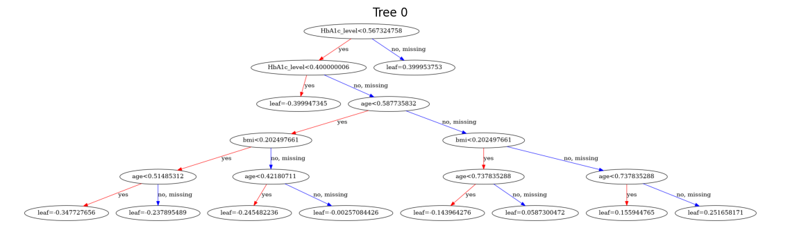

# Prevenção de Diabetes 🚑  

Este projeto utiliza **machine learning** para prever a probabilidade de uma pessoa desenvolver diabetes, ajudando na identificação precoce e possibilitando intervenções preventivas.  

## 📋 Sobre o Projeto  

Com o uso do **XGBoost**, uma poderosa biblioteca de aprendizado de máquina, criamos um modelo capaz de prever a predisposição ao diabetes com base em variáveis como idade, peso, glicose em jejum, entre outras características.  

### Principais Funcionalidades:
- Treinamento de um modelo preditivo usando **XGBoost**.
- Visualização da árvore de decisão gerada pelo modelo.
- Banco de dados em formato CSV para testes e personalização.  

## 📂 Estrutura do Projeto  

A seguir, os principais arquivos e pastas do projeto:  
```
├── data/
│   ├── diabetes_dataset.csv   # Banco de dados utilizado
├── src/
│   ├── diabetes_prediction.py # Script principal com o modelo
│   ├── decision_tree_image.png # Imagem da árvore de decisão gerada
├── README.md  # Este arquivo
```

## 🚀 Como Executar  

### 1️⃣ Pré-Requisitos:
- **Python 3.7+**  
- As bibliotecas listadas no `requirements.txt`:
  ```bash
  pip install -r requirements.txt
  ```  

### 2️⃣ Executar o Script:
1. Clone o repositório:  
    ```bash
    git clone https://github.com/SEU_USUARIO/prevention-diabetes.git
    cd prevention-diabetes
    ```
2. Navegue até a pasta `src` e execute o script:  
    ```bash
    python diabetes_prediction.py
    ```

## 🧪 Dataset  

O dataset utilizado, `diabetes_dataset.csv`, contém informações sobre pacientes e os fatores de risco associados ao diabetes. A estrutura principal do arquivo é:  

| **Coluna**        | **Descrição**                         |  
|--------------------|---------------------------------------|  
| `Age`            | Idade do paciente (em anos).          |  
| `BMI`              | Índice de Massa Corporal.             |  
| `Blood - Pressure` | Pressão sanguínea.                    |  
| ...                | Outras variáveis relevantes.          |  


## 🖼 Visualização  

Uma das árvores de decisão geradas pelo modelo está representada na imagem abaixo:  

  

## 📈 Resultados  

- **Acurácia do modelo**: *xx%*.  
- Outras métricas importantes estão disponíveis ao rodar o script principal.  

## 📜 Licença  

Este projeto é distribuído sob a licença **MIT**. Consulte o arquivo [LICENSE](LICENSE) para mais detalhes.  

## 🙌 Contribuições  

Contribuições são sempre bem-vindas!  
1. Faça um fork do repositório.  
2. Crie uma branch para sua feature:  
    ```bash
    git checkout -b minha-feature
    ```  
3. Faça o commit das suas alterações:  
    ```bash
    git commit -m 'Adicionei uma nova funcionalidade'
    ```  
4. Faça um push para a branch criada:  
    ```bash
    git push origin minha-feature
    ```  
5. Abra um Pull Request.  

Desenvolvido por Derek Willyan.
